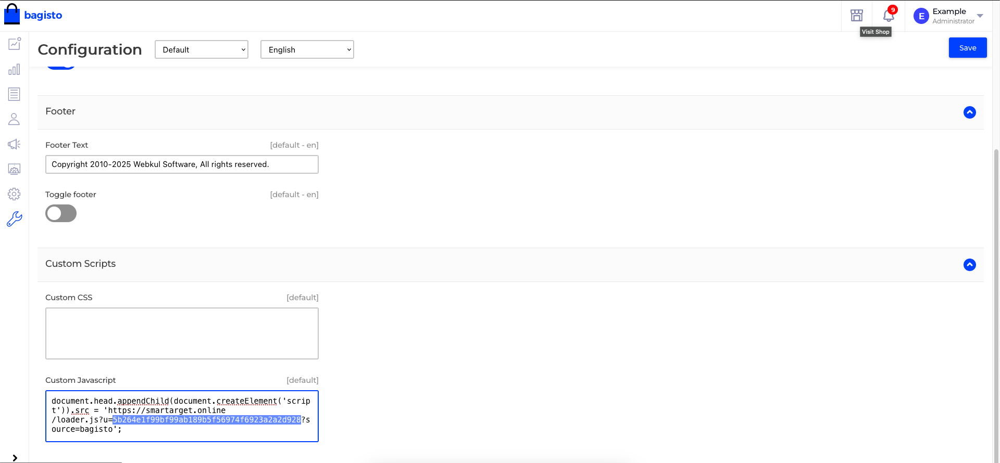

# Smartarget Whatsapp - contact Us for Bagisto
 

This extension integrates [Smartarget Whatsapp - Contact Us](https://smartarget.online/demo.html?ref=bagisto-composer&app=whatsapp) plugin.

## Requirements
- [Bagisto](https://github.com/bagisto/bagisto)

## Support

Need our help? Simply [contact us](https://smartarget.online/page_contact.html) and we will be happy to assist you. 

## Installation

### Method for Non-Develoers:

1. Go to the Bagisto admin
1. Go to Configure >> General
1. Add th following code under *Custom Javascript* (Replace the **XXX** with your own Smartarget ID. You can find it in your [Smartarget Dashboard](https://app.smartarget.online/#/integration) ):

``` 
document.head.appendChild(document.createElement('script')).src = 'https://smartarget.online/loader.js?u=XXX?source=bagisto'; 
```
4. Click on *Save*



### Methods For Developers:

#### Method 1 - Install with composer

Require this package with Composer

	composer require smartarget/bagisto-whatsapp-contact-us

Add the ServiceProvider to the providers array in **config/app.php**

```php
Smartarget\WhatsappContactUs\Providers\WhatsappContactUsServiceProvider::class
```

Run below commands before publishing assets to the public folder:
```
composer dump-autoload
php artisan optimize:clear
php artisan storage:link
```

Go to Whatsapp tab in main menu and configure app!

#### Method 2 - Install with package folder
1. Unzip all the files to **packages/Smartarget/WhatsappContactUs**.

2. Goto composer.json file inside the Bagisto root directory then add the following line under 'psr-4'
```
"Smartarget\\WhatsappContactUs\\": "packages/Smartarget/WhatsappContactUs/src"
```
3. Goto **config/app.php** file then add the following line under 'webkul packages'
```
Smartarget\WhatsappContactUs\Providers\WhatsappContactUsServiceProvider::class
```
4. Run below commands before publishing assets to the public folder:
```
composer dump-autoload
php artisan optimize:clear
php artisan storage:link
```

Go to Whatsapp tab in main menu and configure app!
